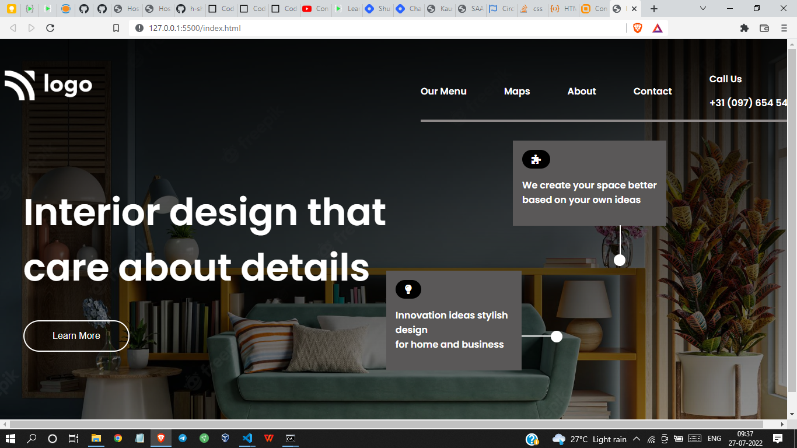

# Project 10 - HTML  and CSS 

By Shreesha

Here's the Live Deployed Website of 

## Project 10  [DEPLOYED LINK](https://project10-interior-design-landing-pg.netlify.app/)

# What did I learn in this project

- I got to learn about the positioning of containers. 
- Got to learn about the flexbox.
- Also got to play with background images.

## Time taken to complete project is 6 hours
